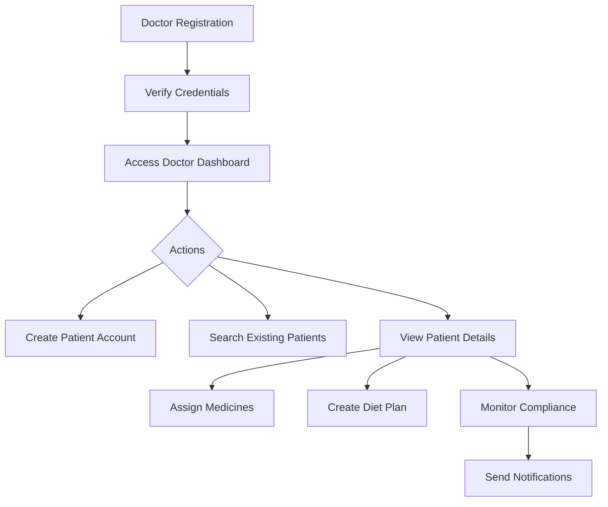
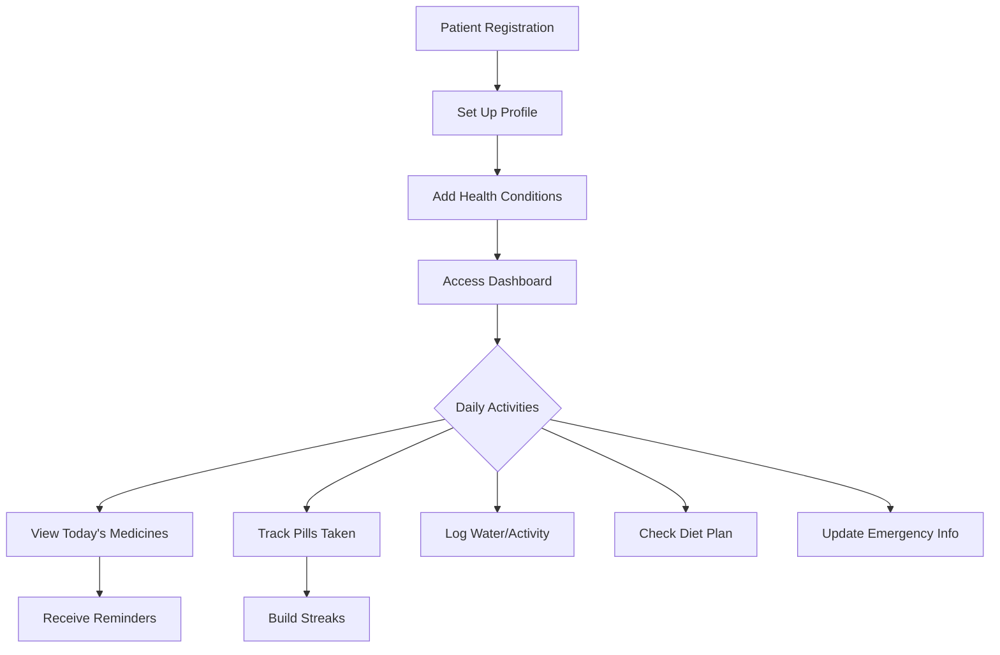

# 🏥 MediAssist+

**Smart Healthcare Companion** - A comprehensive, full-stack web application for managing medications, tracking health metrics, facilitating doctor-patient communication, and promoting healthier lifestyles.


---

## 📋 Table of Contents

- [Overview](#-overview)
- [Key Features](#-key-features)
- [Tech Stack](#️-tech-stack)
- [Project Structure](#-project-structure)
- [Installation](#-installation)
- [Database Schema](#️-database-schema)
- [API Reference](#-api-reference)
- [User Roles & Workflows](#-user-roles--workflows)
- [Screenshots](#-screenshots)
- [Security Features](#-security-features)
- [Configuration](#️-configuration)
- [Customization](#-customization)
- [Troubleshooting](#-troubleshooting)
- [Contributing](#-contributing)
- [License](#-license)
- [Acknowledgments](#-acknowledgments)

---

## 🌟 Overview

MediAssist+ is an all-in-one healthcare management platform designed to bridge the gap between patients and healthcare providers. The application helps users:

- **Never miss a medication** with smart reminders and tracking
- **Monitor health conditions** with comprehensive tracking tools
- **Follow personalized diet plans** assigned by doctors or self-created
- **Maintain emergency information** accessible when needed
- **Track lifestyle metrics** including water intake, exercise, and wellness

Whether you're a patient managing chronic conditions or a doctor overseeing multiple patients, MediAssist+ provides the tools needed for effective healthcare management.

---

## ✨ Key Features

### 👨‍⚕️ Doctor Features

| Feature | Description |
|---------|-------------|
| **Patient Management** | Create, search, and manage patient accounts with full health profiles |
| **Medication Assignment** | Prescribe medicines with detailed dosage, timing, and meal relation instructions |
| **Diet Plan Creation** | Design personalized diet plans targeting specific health conditions |
| **Compliance Dashboard** | Real-time monitoring of patient adherence with alerts for low compliance |
| **Patient Analytics** | View comprehensive statistics on patient health and medication patterns |
| **Communication System** | Send notifications and messages directly to patients |

### 👤 Patient Features

| Feature | Description |
|---------|-------------|
| **Smart Medicine Reminders** | Intelligent notifications based on schedule with meal-relation tracking |
| **Pill Tracker** | Visual dashboard showing daily/weekly/monthly medication adherence |
| **Adherence Streaks** | Gamification elements to encourage consistent medication taking |
| **Diet Planner** | View doctor-assigned or create personal diet plans with macro tracking |
| **Health Hub** | Store and monitor health conditions, lab reports, and vital signs |
| **Lifestyle Tracker** | Track water intake, physical activities, and overall wellness |
| **Emergency Card** | Digital emergency information including blood group, allergies, and contacts |
| **Medical Reports** | Store and analyze medical test reports with abnormality detection |

### 🔔 Notification System

- **Medicine Reminders** - Timely alerts for scheduled medications
- **Missed Dose Alerts** - Notifications when medications are missed
- **Refill Reminders** - Alerts when pill count is running low
- **Expiry Warnings** - Notifications before medications expire
- **Drug Interaction Warnings** - Alerts for potential medication interactions
- **Doctor Messages** - Direct communication from healthcare providers
- **Compliance Reports** - Weekly summary notifications
- **Quiet Hours** - Configurable do-not-disturb periods

### 🏃 Lifestyle & Wellness

- **Water Intake Tracking** - Daily hydration monitoring with goals
- **Activity Logging** - Exercise tracking with calorie burn calculation
- **Weekly Summaries** - Comprehensive health reports delivered weekly
- **Condition-Specific Guidance** - Food recommendations based on health conditions

### 🚨 Emergency Features

- **Emergency Card** - Quick access to critical health information
- **Blood Group** - Store blood type for emergencies
- **Allergy Information** - List of known allergies
- **Emergency Contacts** - Primary and secondary contact details
- **Doctor Information** - Treating physician contact details
- **Hospital Preference** - Preferred hospital for emergencies
- **Unique Access Code** - Shareable code for emergency responders

---

## 🛠️ Tech Stack

| Layer | Technology | Purpose |
|-------|------------|---------|
| **Frontend** | HTML5, CSS3, Vanilla JavaScript | User interface and interactions |
| **Backend** | PHP 8.0+ | Server-side logic and API |
| **Database** | MySQL 5.7+ | Data persistence |
| **Server** | Apache (XAMPP recommended) | Web server |
| **Icons** | Font Awesome 6.4 | UI icons |
| **Fonts** | Google Fonts (Inter) | Typography |
| **Authentication** | Session-based with JWT ready | User security |
| **Architecture** | MVC-inspired REST API | Clean code organization |

---

## 📁 Project Structure

```
mediAssist/
│
├── 📄 index.html                    # Main single-page application
├── 📄 README.md                     # Project documentation
│
├── 📁 api/                          # Backend API
│   ├── 📁 config/
│   │   ├── config.php              # Application configuration (CORS, settings)
│   │   ├── database.php            # Database connection handler
│   │   └── database.example.php    # Example database configuration
│   │
│   ├── 📁 endpoints/               # RESTful API endpoints
│   │   ├── admin.php               # Admin operations & analytics
│   │   ├── diet.php                # Diet plans & meal management
│   │   ├── doctor.php              # Doctor-patient operations
│   │   ├── emergency.php           # Emergency information API
│   │   ├── health.php              # Health conditions & reports
│   │   ├── lifestyle.php           # Activity & water tracking
│   │   ├── medicines.php           # Medicine CRUD operations
│   │   ├── notifications.php       # Notification management
│   │   ├── tracker.php             # Pill tracking & adherence
│   │   └── users.php               # Authentication & profiles
│   │
│   └── 📁 models/                  # Business logic classes
│       ├── AdminSystem.php         # Admin & analytics logic
│       ├── DietPlan.php            # Diet plan management
│       ├── EmergencySafety.php     # Emergency info handling
│       ├── HealthFeatures.php      # Health tracking features
│       ├── Lifestyle.php           # Lifestyle tracking logic
│       ├── Medicine.php            # Medicine management
│       ├── NotificationEngine.php  # Smart notification system
│       ├── PillTracker.php         # Adherence tracking
│       └── User.php                # User management
│
├── 📁 css/
│   └── style.css                   # Complete stylesheet (dark mode support)
│
├── 📁 database/
│   └── schema.sql                  # Complete database schema with all tables
│
├── 📁 js/
│   ├── api.js                      # API service class (fetch wrapper)
│   └── app.js                      # Main application logic
│
└── 📁 uploads/                     # User file uploads directory
```

---

## 🚀 Installation

### Prerequisites

Before installing MediAssist+, ensure you have:

- **[XAMPP](https://www.apachefriends.org/)** v8.0+ (or similar PHP/MySQL stack like WAMP, MAMP, or LAMP)
- **PHP 8.0** or higher
- **MySQL 5.7** or higher
- **Modern web browser** (Chrome, Firefox, Safari, Edge)

### Step-by-Step Installation

#### 1️⃣ Clone or Download the Project

```bash
# Navigate to your web server directory
cd C:\xampp\htdocs

# Clone the repository
git clone https://github.com/your-username/mediAssist.git

# Or download and extract the ZIP file to C:\xampp\htdocs\mediAssist
```

#### 2️⃣ Start XAMPP Services

1. Open **XAMPP Control Panel**
2. Click **Start** next to **Apache**
3. Click **Start** next to **MySQL**
4. Both services should show green "Running" status

#### 3️⃣ Create the Database

1. Open phpMyAdmin: [http://localhost/phpmyadmin](http://localhost/phpmyadmin)
2. Click **"New"** in the left sidebar
3. Enter database name: `mediassist`
4. Select collation: `utf8mb4_unicode_ci`
5. Click **"Create"**

#### 4️⃣ Import Database Schema

1. Select the `mediassist` database
2. Click the **"Import"** tab
3. Click **"Choose File"** and select `database/schema.sql`
4. Click **"Import"** at the bottom

This single file contains all tables, indexes, and reference data needed for the application.

#### 5️⃣ Configure Database Connection

1. Copy the example configuration:
   ```bash
   cp api/config/database.example.php api/config/database.php
   ```

2. Edit `api/config/database.php`:
   ```php
   <?php
   $servername = "localhost";
   $username = "root";
   $password = "";           // Your MySQL password (blank for default XAMPP)
   $dbname = "mediassist";
   
   $con = mysqli_connect($servername, $username, $password, $dbname);
   
   if (!$con) {
       die(json_encode(['error' => 'Database connection failed']));
   }
   
   mysqli_set_charset($con, "utf8mb4");
   ```

#### 6️⃣ Set Directory Permissions

Ensure the `uploads` directory is writable:
```bash
# On Windows (usually automatic)
# On Linux/Mac:
chmod 755 uploads/
```

#### 7️⃣ Access the Application

Open your browser and navigate to:
```
http://localhost/mediAssist
```

---

## 🗄️ Database Schema

### Core Tables Overview

| Table | Description | Key Fields |
|-------|-------------|------------|
| `users` | User accounts (patients & doctors) | id, email, username, role, full_name |
| `medicines` | Medication records | id, user_id, name, dosage, frequency, schedules |
| `medicine_schedules` | Individual dose times | medicine_id, scheduled_time, meal_relation |
| `pill_tracking` | Adherence records | user_id, medicine_id, status, taken_at |
| `diet_plans` | Nutrition plans | user_id, target_calories, condition_focus |
| `meals` | Individual meal entries | diet_plan_id, meal_type, calories, macros |
| `health_conditions` | Condition definitions | name, description, dietary_restrictions |
| `user_health_conditions` | User-condition links | user_id, condition_id, diagnosed_date |
| `notifications` | User notifications | user_id, type, title, message, is_read |
| `doctor_patients` | Doctor-patient relationships | doctor_id, patient_id, status |
| `emergency_info` | Emergency medical info | user_id, blood_group, allergies, contacts |

### Reference Data Tables

| Table | Purpose |
|-------|---------|
| `medicine_interactions` | Drug interaction warnings |
| `common_side_effects` | Known medication side effects |
| `lab_reference_ranges` | Normal values for lab tests |
| `health_risk_rules` | Automated health alerts |
| `foods` | Food nutrition database |
| `condition_food_restrictions` | Diet restrictions by condition |
| `activity_reference` | Exercise calorie burn data |

### Tracking Tables

| Table | Purpose |
|-------|---------|
| `water_intake` | Daily hydration logs |
| `activity_log` | Exercise and activity records |
| `medical_reports` | Stored lab reports |
| `report_values` | Parsed lab values |
| `weekly_summaries` | Generated weekly reports |
| `audit_log` | System activity logging |

---

## 📡 API Reference

### Authentication Endpoints

```http
POST /api/endpoints/users.php?action=register
```
Register a new user account.

**Request Body:**
```json
{
  "email": "user@example.com",
  "password": "securepassword",
  "full_name": "John Doe",
  "role": "patient",
  "phone": "+1234567890",
  "date_of_birth": "1990-01-15",
  "gender": "male"
}
```

**Doctor Registration (additional fields):**
```json
{
  "role": "doctor",
  "specialization": "Cardiology",
  "license_number": "DOC12345",
  "clinic_name": "City Heart Clinic",
  "clinic_address": "123 Medical Street"
}
```

---

```http
POST /api/endpoints/users.php?action=login
```
Authenticate user and start session.

**Request Body:**
```json
{
  "email": "user@example.com",
  "password": "securepassword"
}
```

**Response:**
```json
{
  "success": true,
  "user": {
    "id": 1,
    "email": "user@example.com",
    "full_name": "John Doe",
    "role": "patient"
  }
}
```

---

### Medicine Endpoints

```http
GET /api/endpoints/medicines.php?user_id={id}&active_only=true
```
Get all medicines for a user.

```http
GET /api/endpoints/medicines.php?action=today&user_id={id}
```
Get today's scheduled medicines.

```http
POST /api/endpoints/medicines.php?action=create
```
Create a new medicine with schedules.

**Request Body:**
```json
{
  "user_id": 1,
  "name": "Metformin",
  "dosage": "500mg",
  "dose_type": "tablet",
  "frequency": "twice",
  "duration_days": 30,
  "start_date": "2026-01-01",
  "instructions": "Take with food",
  "schedules": [
    { "time": "08:00", "dose_amount": "1", "meal_relation": "after_meal" },
    { "time": "20:00", "dose_amount": "1", "meal_relation": "after_meal" }
  ]
}
```

---

### Tracker Endpoints

```http
GET /api/endpoints/tracker.php?action=dashboard&user_id={id}
```
Get dashboard data including today's progress and streaks.

```http
POST /api/endpoints/tracker.php?action=record
```
Record pill taken/missed status.

**Request Body:**
```json
{
  "user_id": 1,
  "medicine_id": 5,
  "schedule_id": 12,
  "status": "taken",
  "date": "2026-01-02",
  "time": "08:00:00"
}
```

```http
GET /api/endpoints/tracker.php?action=stats&user_id={id}&days=30
```
Get adherence statistics for specified period.

---

### Doctor Endpoints

```http
GET /api/endpoints/doctor.php?action=patients&doctor_id={id}
```
Get all patients assigned to a doctor.

```http
GET /api/endpoints/doctor.php?action=dashboard&doctor_id={id}
```
Get doctor dashboard with compliance overview.

```http
POST /api/endpoints/doctor.php?action=create_patient
```
Create a new patient account under doctor.

```http
POST /api/endpoints/doctor.php?action=assign_medicine
```
Assign medication to a patient.

**Request Body:**
```json
{
  "doctor_id": 1,
  "patient_id": 5,
  "name": "Lisinopril",
  "dosage": "10mg",
  "frequency": "once",
  "duration_days": 90,
  "prescription_notes": "For blood pressure management",
  "schedules": [
    { "time": "09:00", "dose_amount": "1", "meal_relation": "before_meal" }
  ]
}
```

---

### Diet Endpoints

```http
GET /api/endpoints/diet.php?action=active&user_id={id}
```
Get active diet plan with meals.

```http
POST /api/endpoints/diet.php?action=create
```
Create a new diet plan.

```http
GET /api/endpoints/diet.php?action=suggestions&user_id={id}
```
Get diet suggestions based on health conditions.

---

### Notification Endpoints

```http
GET /api/endpoints/notifications.php?user_id={id}&unread_only=true
```
Get user notifications.

```http
PUT /api/endpoints/notifications.php?action=mark_read
```
Mark notification as read.

```http
GET /api/endpoints/notifications.php?action=preferences&user_id={id}
```
Get notification preferences.

---

### Emergency Endpoints

```http
GET /api/endpoints/emergency.php?user_id={id}
```
Get emergency information for a user.

```http
POST /api/endpoints/emergency.php
```
Save/update emergency information.

```http
GET /api/endpoints/emergency.php?action=access&code={access_code}
```
Access emergency info via public access code (for emergency responders).

---

### Lifestyle Endpoints

```http
POST /api/endpoints/lifestyle.php?action=water
```
Log water intake.

```http
GET /api/endpoints/lifestyle.php?action=water_today&user_id={id}
```
Get today's water intake.

```http
POST /api/endpoints/lifestyle.php?action=activity
```
Log physical activity.

```http
GET /api/endpoints/lifestyle.php?action=weekly_summary&user_id={id}
```
Get weekly lifestyle summary.

---

## 👥 User Roles & Workflows

### 🏥 Doctor Workflow



1. **Register** as a doctor with credentials (license number, specialization)
2. **Create patients** or search for existing patients to add to your list
3. **Assign medications** with detailed schedules and instructions
4. **Create diet plans** tailored to patient health conditions
5. **Monitor compliance** through the dashboard
6. **Communicate** with patients through notifications

### 👤 Patient Workflow



1. **Register** and complete health profile
2. **Add health conditions** for personalized recommendations
3. **Add medications** (or receive from doctor)
4. **Track daily pills** with easy take/miss buttons
5. **Follow diet plans** with meal-by-meal guidance
6. **Monitor progress** through visual dashboards
7. **Set up emergency info** for safety

---

## 📸 Screenshots

### Landing Page
- Modern, responsive design with feature highlights
- Easy registration and login access
- Dark mode support

### Patient Dashboard
- Today's medication schedule
- Adherence streak counter
- Quick action buttons
- Progress visualization

### Doctor Dashboard  
- Patient overview cards
- Compliance statistics
- Low adherence alerts
- Quick patient search

### Medicine Management
- Detailed medication cards
- Schedule visualization
- Meal relation indicators
- Stock tracking

### Diet Planner
- Meal-by-meal planning
- Macro nutrient tracking
- Condition-based suggestions
- Restricted foods alerts

---

## 🔒 Security Features

| Feature | Implementation |
|---------|---------------|
| **Password Hashing** | PHP `password_hash()` with bcrypt |
| **SQL Injection Prevention** | Prepared statements throughout |
| **XSS Protection** | Input sanitization and output encoding |
| **CORS Configuration** | Configurable cross-origin headers |
| **Session Management** | Secure PHP sessions |
| **Input Validation** | Server-side validation on all inputs |
| **Role-Based Access** | Doctor/Patient permission checks |
| **Error Handling** | Sanitized error messages in production |

### Security Best Practices

```php
// Example: Secure database query
$stmt = mysqli_prepare($con, "SELECT * FROM users WHERE email = ?");
mysqli_stmt_bind_param($stmt, "s", $email);
mysqli_stmt_execute($stmt);
```

---

## ⚙️ Configuration

### Application Settings (`api/config/config.php`)

```php
<?php
// Timezone
date_default_timezone_set('Asia/Kolkata');

// Application Settings
define('APP_NAME', 'MediAssist+');
define('APP_VERSION', '2.0.0');
define('UPLOAD_DIR', __DIR__ . '/../../uploads/');
define('MAX_FILE_SIZE', 10 * 1024 * 1024); // 10MB

// JWT Settings (for future implementation)
define('JWT_SECRET', 'your-secret-key-change-in-production');
define('JWT_EXPIRY', 86400); // 24 hours
```

### Database Settings (`api/config/database.php`)

```php
<?php
$servername = "localhost";
$username = "root";
$password = "";
$dbname = "mediassist";

$con = mysqli_connect($servername, $username, $password, $dbname);
mysqli_set_charset($con, "utf8mb4");
```

### Notification Preferences (per user)

| Setting | Default | Description |
|---------|---------|-------------|
| `medicine_reminders` | true | Medication schedule alerts |
| `missed_dose_alerts` | true | Missed medication warnings |
| `refill_alerts` | true | Low pill count reminders |
| `expiry_alerts` | true | Medication expiry warnings |
| `interaction_warnings` | true | Drug interaction alerts |
| `quiet_hours_start` | 22:00 | Start of do-not-disturb |
| `quiet_hours_end` | 07:00 | End of do-not-disturb |

---

## 🎨 Customization

### Theme Variables

The application supports both light and dark modes. Customize colors in `css/style.css`:

```css
:root {
    /* Primary Colors */
    --primary: #6366f1;
    --primary-dark: #4f46e5;
    --primary-light: #818cf8;
    
    /* Status Colors */
    --success: #10b981;
    --warning: #f59e0b;
    --danger: #ef4444;
    --info: #3b82f6;
    
    /* Background Colors */
    --bg-primary: #ffffff;
    --bg-secondary: #f8fafc;
    
    /* Text Colors */
    --text-primary: #1e293b;
    --text-secondary: #64748b;
    
    /* Border & Shadow */
    --border-color: #e2e8f0;
    --shadow: 0 1px 3px rgba(0,0,0,0.1);
}

/* Dark Mode */
[data-theme="dark"] {
    --bg-primary: #0f172a;
    --bg-secondary: #1e293b;
    --text-primary: #f1f5f9;
    --text-secondary: #94a3b8;
    --border-color: #334155;
}
```

### Adding New Health Conditions

Insert into the `health_conditions` table:

```sql
INSERT INTO health_conditions (name, description, dietary_restrictions) VALUES
('GERD', 'Gastroesophageal reflux disease', 'Avoid spicy foods, citrus, caffeine, chocolate');
```

### Adding Food Restrictions

```sql
INSERT INTO condition_food_restrictions 
(condition_name, food_category, restriction_type, reason, alternatives) VALUES
('GERD', 'Citrus fruits', 'avoid', 'Can trigger acid reflux', 'Melons, bananas, apples');
```

---

## 🔧 Troubleshooting

### Common Issues

#### Database Connection Failed
```
Error: "Database connection failed"
```
**Solution:**
1. Verify MySQL is running in XAMPP
2. Check credentials in `api/config/database.php`
3. Ensure `mediassist` database exists

#### JSON Parse Error
```
Error: "Server returned invalid response"
```
**Solution:**
1. Check PHP error logs in `C:\xampp\php\logs\`
2. Ensure no PHP warnings are being output
3. Verify database schema is properly imported

#### CORS Errors
```
Error: "Access-Control-Allow-Origin"
```
**Solution:**
1. Verify `api/config/config.php` has proper CORS headers
2. Check browser console for specific CORS messages

#### Blank Page / 500 Error
**Solution:**
1. Enable PHP error display temporarily:
   ```php
   ini_set('display_errors', 1);
   error_reporting(E_ALL);
   ```
2. Check Apache error log: `C:\xampp\apache\logs\error.log`

#### Notifications Not Working
**Solution:**
1. Check browser notification permissions
2. Verify notification preferences in user settings
3. Ensure quiet hours are not active

### Performance Tips

1. **Index Optimization**: The schema includes indexes for common queries
2. **Query Optimization**: Use pagination for large datasets
3. **Caching**: Consider adding Redis for session/data caching
4. **CDN**: Use CDN for Font Awesome and Google Fonts (already configured)

---

## 🤝 Contributing

We welcome contributions! Here's how you can help:

### Getting Started

1. **Fork** the repository
2. **Clone** your fork locally
3. **Create** a feature branch
   ```bash
   git checkout -b feature/YourAmazingFeature
   ```
4. **Make** your changes
5. **Test** thoroughly
6. **Commit** with clear messages
   ```bash
   git commit -m "Add: Your feature description"
   ```
7. **Push** to your branch
   ```bash
   git push origin feature/YourAmazingFeature
   ```
8. **Open** a Pull Request

### Contribution Guidelines

- Follow existing code style and patterns
- Add comments for complex logic
- Update documentation for new features
- Write meaningful commit messages
- Test on multiple browsers

### Areas for Contribution

- 🐛 Bug fixes
- ✨ New features
- 📝 Documentation improvements
- 🎨 UI/UX enhancements
- 🌐 Internationalization
- ♿ Accessibility improvements
- ⚡ Performance optimizations

---

## 📄 License

This project is licensed under the **MIT License** - see the [LICENSE](LICENSE) file for details.

```
MIT License

Copyright (c) 2026 MediAssist+ Team

Permission is hereby granted, free of charge, to any person obtaining a copy
of this software and associated documentation files (the "Software"), to deal
in the Software without restriction, including without limitation the rights
to use, copy, modify, merge, publish, distribute, sublicense, and/or sell
copies of the Software, and to permit persons to whom the Software is
furnished to do so, subject to the following conditions:

The above copyright notice and this permission notice shall be included in all
copies or substantial portions of the Software.
```

---

## 👨‍💻 Author

**MediAssist+ Team**

---

## 🙏 Acknowledgments

- **[Font Awesome](https://fontawesome.com/)** - Beautiful icons
- **[Google Fonts](https://fonts.google.com/)** - Inter font family
- **[UI Avatars](https://ui-avatars.com/)** - Dynamic avatar generation
- **[XAMPP](https://www.apachefriends.org/)** - Development environment

---

## 📞 Support

If you encounter any issues or have questions:

1. **Check the [Troubleshooting](#-troubleshooting) section** above
2. **Search existing [Issues](../../issues)** for similar problems
3. **Open a new issue** with detailed information about your problem

---

## 🗺️ Roadmap

Future planned features:

- [ ] Mobile application (React Native)
- [ ] Push notifications via Firebase
- [ ] Integration with wearable devices
- [ ] Telemedicine video consultations
- [ ] Pharmacy integration for refills
- [ ] AI-powered health insights
- [ ] Multi-language support
- [ ] Export data to PDF/Excel
- [ ] Family account management
- [ ] Integration with health insurance

---

<p align="center">
  
  <br>
  <strong>MediAssist+ - Your Smart Healthcare Companion</strong>
  <br>
  <em>Better health management, one pill at a time.</em>
</p>
